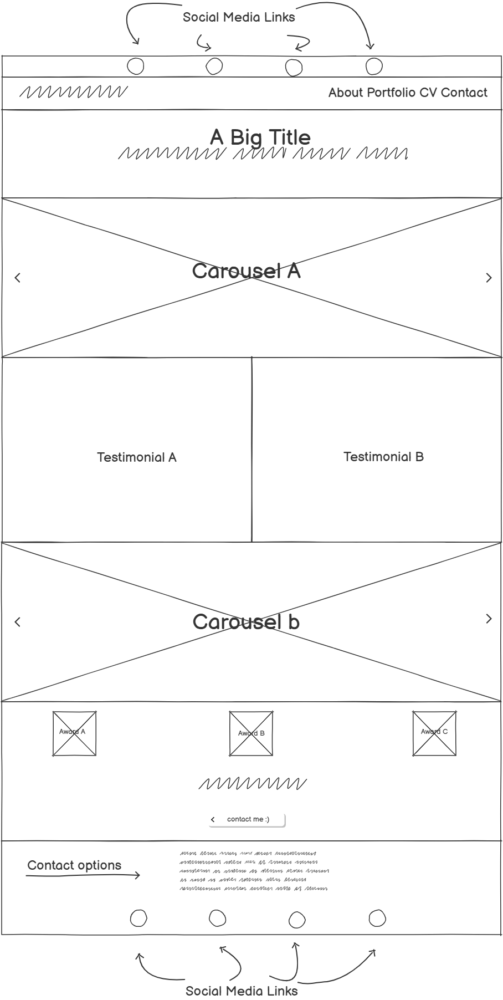
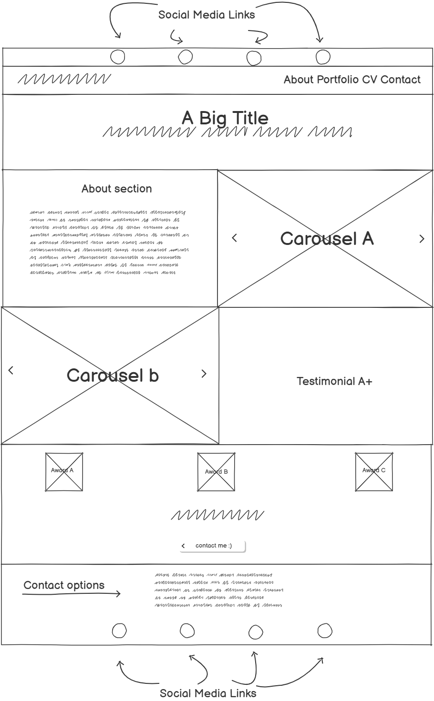
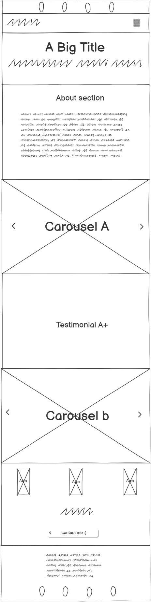
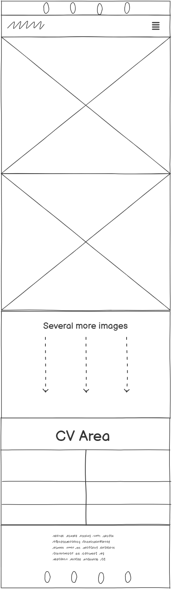
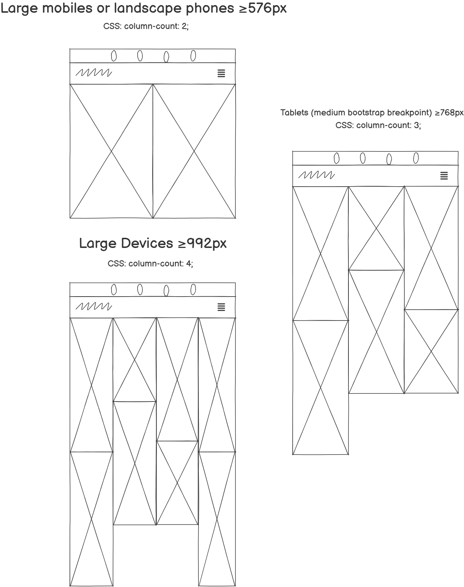
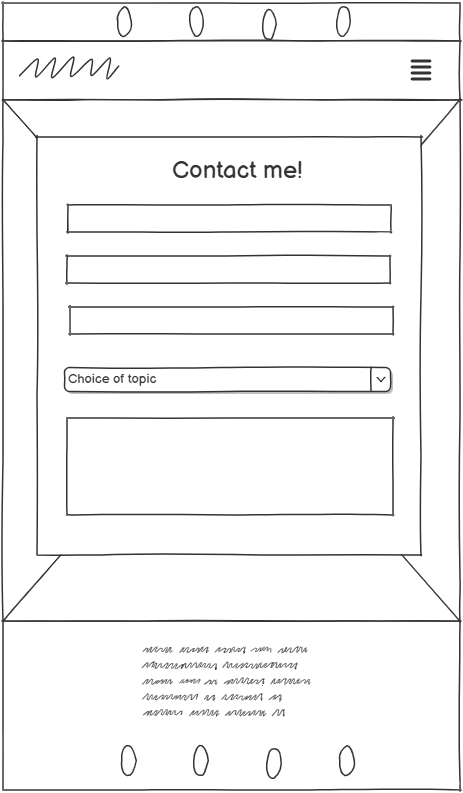
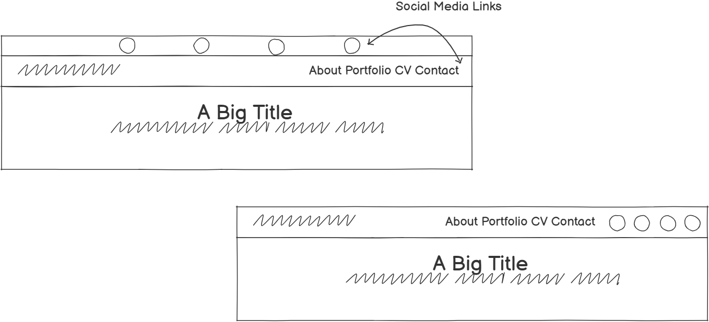

# [Han Hair and Makeup](https://cjperk445.github.io/hairandmakeup/)

## Introduction

- Hannah Mary Hair and Makeup is a simple website to showcase a hairdresser + Make up arists portfolio and for any would-be customers to contact said hairdresser.

- This website is targeted towards people local to the hairdresser to show off Hannah Mary's work.

- Han Hair and make up will include the following: An introduction and details about Hannah Mary and her work, a portfolio of Make-up and hairstyles, a simple CV with some information on past work, contact information to get in touch and book a consultation.

![Am I Responsive] - an image of the responsiveness of the website

## Features

-   Aimed to be Responsive on all device sizes

-   Form Element

- Interactive Elements

## Technologies Used

### Languages Used

-   [HTML5](https://en.wikipedia.org/wiki/HTML5)
-   [CSS3](https://en.wikipedia.org/wiki/Cascading_Style_Sheets)

### Frameworks, Libraries & Programs Used

1. [Bootstrap 5.3.3](https://getbootstrap.com/docs/5.3/getting-started/introduction/)
    - Bootstrap was used to assist with the responsiveness of the website as well as using their column and row properties.
1. [Google Fonts:](https://fonts.google.com/)
    - Google fonts were used to import the "Pridi" and "Niconne" fonts into the style.css file which were used across the project.
1. [Font Awesome:](https://fontawesome.com/)
    - Font Awesome was used on all pages throughout the website to add icons for such things as social media links. 
1. [GitHub:](https://github.com/)
    - I used Github to host my code and to deploy on github pages (explained in more detail later).
1. [Balsamiq:](https://balsamiq.com/)
    - Balsamiq was used to create the wireframes.
1. [Gimp](https://www.gimp.org/)
    - Gimp is a free to use alternative to Photoshop and was used to edit some images.
1. [WebAim](https://webaim.org/resources/contrastchecker/)
    - Used to check that the colour scheme had sufficient contrast, the original colour chosen did not and had to be altered to get enough contrast.

## Wireframes

Created using [Balsamiq](https://balsamiq.com)

I created the wireframes using Balsamiq, I wanted to focus on mobile devices and scale up to larger devices. However I sketched the laptop size initially.

The first sketch for laptops and larger screens(≥992px)

The second sketch which is the design I went for added an about me section at the top and squeezed the divs into a smaller space to make better use of the screen space

With this second sketch in mind I went on and sketched the website on a mobile device (<576px)

Once I was happy I went on to sketch the portfolio page. Early on I'd decided to take inspiration from the love running project that the website would have a masonry wall approach and a seperate CV area at the bottom. The masonry wall would be responsive to the screen size as the sketch below illustrates, it would be utilising the CSS column-count property. 

Then the Contact Page: 

Whilst building and testing the site the social media links at the top of the page were not as aesthetically pleasing as I wanted so I moved the logos to sit next to the nav links in the navbar. 

## About the build:

### index.html
I started the project and created all of the required pages: index.html, contact.html, portfolio.html, 

I created the assets and images folder, further on I would seperate the images folder into sub-sections as there were numerous styles of work on offer, these further sub-folders were labelled Hair, Makeup, Awards and Readme. This will hopefully make it easy to navigate to specific images within the folder tree.

### contact.html

### portfolio.html

added basic structure of main page, used bootstrap nav bar, will edit for own function later. 
added css stylesheet, including css variables for main color scheme. 
had to change colour scheme as there was not enough contrast with the primary and highlight colors used https://webaim.org/resources/contrastchecker/ to check. 
made an error whilst creating favicon, had to remake it with better size of logo so it would show up better on the tab

### Testing

## Testing Index.html

|           Action            |                                Expectation                                 | Outcome |
| :-------------------------: | :------------------------------------------------------------------------: | :-----: |
|           Header            |                          Adjusts with screen size                          |  Pass   |
|        Click on logo        |                           Takes you to home page                           |  Pass   |
|       Navigation bar        |                 Active page Highlighted, adjusts with size                 |  Pass   |
|    Navigation bar - Home    |            Clicked from Index.html it Takes you to index.html              |  Pass   |
|    Navigation bar - About   |Clicked from Index.html it Takes you to index.html and scrolls to #about    |  Pass   |
| Navigation bar - Portfolio  |Clicked from Index.html it Takes you to portfolio.html                      |  Pass   |
|    Navigation bar - CV      |Clicked from Index.html it Takes you to portfolio.html and scrolls to #cv   |  Pass   |
|  Navigation bar - Instagram |Clicked from Index.html it opens instagram.com in new tab                   |  Pass   |
|   Navigation bar - Facebook |Clicked from Index.html it opens facebook.com in new tab                    |  Pass   |
|    Navigation bar - X       |Clicked from Index.html it opens twitter.com in new tab                     |  Pass   |
|  Navigation bar - Pinterest |Clicked from Index.html it opens pinterest.com in new tab                   |  Pass   |
| Nav bar links: on hover     | They change colour                                                         |  Pass   |
| Nav bar Social links: on hover     | They change colour                                                  |  Pass   |
| Carousel id #makeupCarousel |Both Carousel Buttons work to flip through pictures                         |  Pass   |
| Carousel id #hair  Carousel |Both Carousel Buttons work to flip through pictures                         |  Pass   |
| Drop me a line! Button      |when clicked takes you to contact.html                                      |  Pass   |
| Drop me a line! Button on hover|Changes Colour                                                           |  Pass   |
| Bottom bar Social links: on hover     | They change colour                                               |  Pass   |
|  Bottom Bar - Instagram     |Clicked from Index.html it opens instagram.com in new tab                   |  Pass   |
|   Bottom Bar - Facebook     |Clicked from Index.html it opens facebook.com in new tab                    |  Pass   |
|   Bottom Bar - X            |Clicked from Index.html it opens twitter.com in new tab                     |  Pass   |
|  Bottom Bar - Pinterest     |Clicked from Index.html it opens pinterest.com in new tab                   |  Pass   |

## Testing Portfolio Page

|           Action            |                                Expectation                                 | Outcome |
| :-------------------------: | :------------------------------------------------------------------------: | :-----: |
|           Header            |                          Adjusts with screen size                          |  Pass   |
|        Click on logo        |                           Takes you to home page                           |  Pass   |
|       Navigation bar        |                 Active page Highlighted, adjusts with size                 |  Pass   |
|    Navigation bar - Home    |            Takes you to index.html                                         |  Pass   |
|    Navigation bar - About   | Takes you to index.html and scrolls to #about                              |  Pass   |
| Navigation bar - Portfolio  | Takes you to portfolio.html                                                |  Pass   |
|    Navigation bar - CV      | it Takes you to portfolio.html and scrolls to #CV                          |  Pass   |
|  Navigation bar - Instagram | it opens instagram.com in new tab                                          |  Pass   |
|   Navigation bar - Facebook | it opens facebook.com in new tab                                           |  Pass   |
|    Navigation bar - X       | it opens twitter.com in new tab                                            |  Pass   |
|  Navigation bar - Pinterest |it opens pinterest.com in new tab                                           |  Pass   |
| Nav bar links: on hover     | They change colour                                                         |  Pass   |
| Nav bar Social links: on hover     | They change colour                                                  |  Pass   |
| Images in portfolio         |Adjust with screen size, different # of columns dependant on screen size    |  Pass   |
| Images in portfolio on hover|  They zoom out and change z-index to front of screen                       |  Pass   |
| CV on Hover                 |Changes Colour                                                              |  Pass   |
| Bottom bar Social links: on hover     | They change colour                                               |  Pass   |
|  Bottom Bar - Instagram     |Clicked from Index.html it opens instagram.com in new tab                   |  Pass   |
|   Bottom Bar - Facebook     |Clicked from Index.html it opens facebook.com in new tab                    |  Pass   |
|   Bottom Bar - X            |Clicked from Index.html it opens twitter.com in new tab                     |  Pass   |
|  Bottom Bar - Pinterest     |Clicked from Index.html it opens pinterest.com in new tab                   |  Pass   |

## Testing Contact Page

|           Action            |                                Expectation                                 | Outcome |
| :-------------------------: | :------------------------------------------------------------------------: | :-----: |
|           Header            |                          Adjusts with screen size                          |  Pass   |
|        Click on logo        |                           Takes you to home page                           |  Pass   |
|       Navigation bar        |                 Active page Highlighted, adjusts with size                 |  Pass   |
|    Navigation bar - Home    |            Takes you to index.html                                         |  Pass   |
|    Navigation bar - About   | Takes you to index.html and scrolls to #about                              |  Pass   |
| Navigation bar - Portfolio  | Takes you to portfolio.html                                                |  Pass   |
|    Navigation bar - CV      | it Takes you to portfolio.html and scrolls to #CV                          |  Pass   |
|  Navigation bar - Instagram | it opens instagram.com in new tab                                          |  Pass   |
|   Navigation bar - Facebook | it opens facebook.com in new tab                                           |  Pass   |
|    Navigation bar - X       | it opens twitter.com in new tab                                            |  Pass   |
|  Navigation bar - Pinterest |it opens pinterest.com in new tab                                           |  Pass   |
| Nav bar links: on hover     | They change colour                                                         |  Pass   |
| Nav bar Social links: on hover     | They change colour                                                  |  Pass   |
| Form Elements               |All form elements must be filled in before it will allow the form to be submitted    |  Pass   |
| Submit button               |Will open up confimation page                                               |  Pass   |
| Submit button on hover      |Changes colour                                                              |  Pass   |
| Bottom bar Social links: on hover     | They change colour                                               |  Pass   |
|  Bottom Bar - Instagram     |Clicked from Index.html it opens instagram.com in new tab                   |  Pass   |
|   Bottom Bar - Facebook     |Clicked from Index.html it opens facebook.com in new tab                    |  Pass   |
|   Bottom Bar - X            |Clicked from Index.html it opens twitter.com in new tab                     |  Pass   |
|  Bottom Bar - Pinterest     |Clicked from Index.html it opens pinterest.com in new tab                   |  Pass   |

## Testing Confirmation Page

|           Action            |                                Expectation                                 | Outcome |
| :-------------------------: | :------------------------------------------------------------------------: | :-----: |
|           Header            |                          Adjusts with screen size                          |  Pass   |
|        Click on logo        |                           Takes you to home page                           |  Pass   |
|       Navigation bar        |                 Active page Highlighted, adjusts with size                 |  Pass   |
|    Navigation bar - Home    |            Takes you to index.html                                         |  Pass   |
|    Navigation bar - Home    |            Takes you to index.html                                         |  Pass   |
|    Navigation bar - About   | Takes you to index.html and scrolls to #about                              |  Pass   |
| Navigation bar - Portfolio  | Takes you to portfolio.html                                                |  Pass   |
|    Navigation bar - CV      | it Takes you to portfolio.html and scrolls to #CV                          |  Pass   |
|  Navigation bar - Instagram | it opens instagram.com in new tab                                          |  Pass   |
|   Navigation bar - Facebook | it opens facebook.com in new tab                                           |  Pass   |
|    Navigation bar - X       | it opens twitter.com in new tab                                            |  Pass   |
|  Navigation bar - Pinterest |it opens pinterest.com in new tab                                           |  Pass   |
| Nav bar links: on hover     | They change colour                                                         |  Pass   |
| Nav bar Social links: on hover     | They change colour                                                  |  Pass   |
| Bottom bar Social links: on hover     | They change colour                                               |  Pass   |
|  Bottom Bar - Instagram     |Clicked from Index.html it opens instagram.com in new tab                   |  Pass   |
|   Bottom Bar - Facebook     |Clicked from Index.html it opens facebook.com in new tab                    |  Pass   |
|   Bottom Bar - X            |Clicked from Index.html it opens twitter.com in new tab                     |  Pass   |
|  Bottom Bar - Pinterest     |Clicked from Index.html it opens pinterest.com in new tab                   |  Pass   |

### HTML Validator

The HTML Validator used throughout was the [W3C](https://validator.w3.org/) Validator. Final checks on all pages flag up no errors nor warnings

### CSS Validator

The CSS Validator used throughout was the [W3C](jigsaw.w3.org/css-validator/) Validator. Final checks on the CSS brought up one warning I was not able to tackle but did not pose a problem to the website. 
- `CSS Line 338 translatZ(0) is not a transform value`

## Deployment

- The site was deployed to GitHub pages.

- Steps of deployment:

1. Open repository [Han Hair And Makeup](https://github.com/cjperk445/hairandmakeup).
2. Go to settings.
3. Locate the Pages link in the menu section on the left of the screen.
4. Locate the Branch, click on none then and select main option.
5. Click on the save button.
6. After couple of minutes reload the page and you will have a live site at the top of the site.
7. Click on the link and it will take you to a live site. 

- Local deployment steps:

1. Open my repository [Han Hair And Makeup](https://github.com/cjperk445/hairandmakeup).
2. Locate and click on the green button with Code written on it.
3. Copy the link from the menu
4. Clone the code onto your machine and start working on the code.

## Credits

### Code
- The code used so the images in the portfolio hover comes from: [codeply] (https://www.codeply.com/go/JuADMG3eTG/bootstrap-image-hover-css-zoom-scale)I then added "z-hover 1" so the image hovered over will cover the other images by coming to the front.
- The masonry wall effect code was learnt from the "Love running" module and used near verbatim.

### Media

- All Hair and Makeup photos used on the site were taken (with permission) from [hanjones23's site](https://hanjones23.wixsite.com/portfolio)
- The colour pallet and colour scheme were taken as an inspiration from [Pinterest](https://www.pinterest.com)
- The Favicon image was created using [Bing Image Creator](https://www.bing.com/images/create) then turned into a favicon using [Favicon.io](https://favicon.io/)
- The Award logos were either created by myself using [gimp](https://www.gimp.org/) or borrowed from [The Wedding industry Awards](https://www.the-wedding-industry-awards.co.uk/) and [The Welsh Hair and Beauty awards](https://www.facebook.com/WelshHairandBeautyAwards/)

