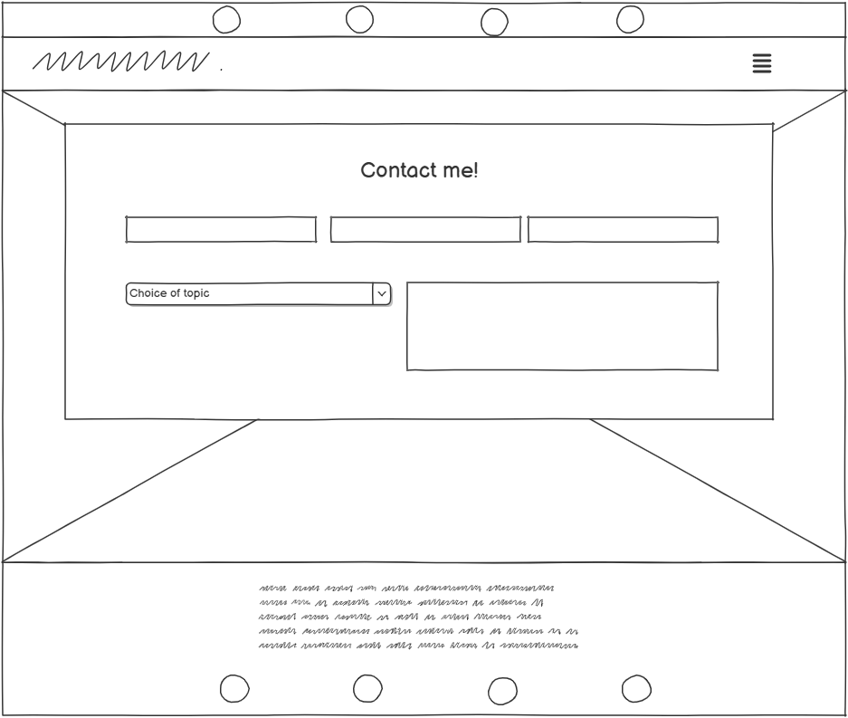

# [Han Hair and Makeup](https://cjperk445.github.io/hairandmakeup/)

## Introduction

- Hannah Mary Hair and Makeup is a simple website to showcase a hairdresser + Make up arists portfolio and for any would-be customers to contact said hairdresser.

- This website is targeted towards people local to the hairdresser to show off Hannah Mary's work.

- Han Hair and make up will include the following: An introduction and details about Hannah Mary and her work, a portfolio of Make-up and hairstyles, a simple CV with some information on past work, contact information to get in touch and book a consultation.

![Am I Responsive] - an image of the responsiveness of the website

## Wireframes

Created using [Balsamiq](https://balsamiq.com)

I created the wireframes using Balsamiq, I wanted to focus on mobile devices and scale up to larger devices. However I sketched the laptop size initially.

The first sketch for laptops and larger screens(≥992px)

The second sketch which is the design i went for added an about me section at the top and squeezed the divs into a smaller space to make better use of the screen space

With this second sketch in mind I went on and sketched the website on a mobile device (<576px)

Once I was happy I went on to sketch the portfolio page. Early on I'd decided to take inspiration from the love running project that the website would have a masonry wall approach and a seperate CV area at the bottom. The masonry wall would be responsive to the screen size as the sketch below illustrates, it would be utilising the CSS column-count property. 

Then the Contact Page: 

Whilst building and testing the site the social media links at the top of the page were not as aesthetically pleasing as I wanted so I moved the logos to sit next to the nav links in the navbar. 

## About the build:

### index.html
I started the project and created all of the required pages: index.html, contact.html, portfolio.html, 

I created the assets and images folder, further on I would seperate the images folder into sub-sections as there were numerous styles of work on offer, these further sub-folders were labelled Hair, Makeup, Awards and Readme. This will hopefully make it easy to navigate to specific images within the folder tree.

### contact.html

### portfolio.html

added basic structure of main page, used bootstrap nav bar, will edit for own function later. 
added css stylesheet, including css variables for main color scheme. 
had to change colour scheme as there was not enough contrast with the primary and highlight colors used https://webaim.org/resources/contrastchecker/ to check. 
made an error whilst creating favicon, had to remake it with better size of logo so it would show up better on the tab
11/12/2024 decided to remove social bar from top of the screen and added to the navbar, made sure to center it on smaller screens, then spaced them out ans shrunk them on larger screen
img hover from . https://www.codeply.com/go/JuADMG3eTG/bootstrap-image-hover-css-zoom-scale (added z-hover 9999 so the image hovered over will cover the other images)

